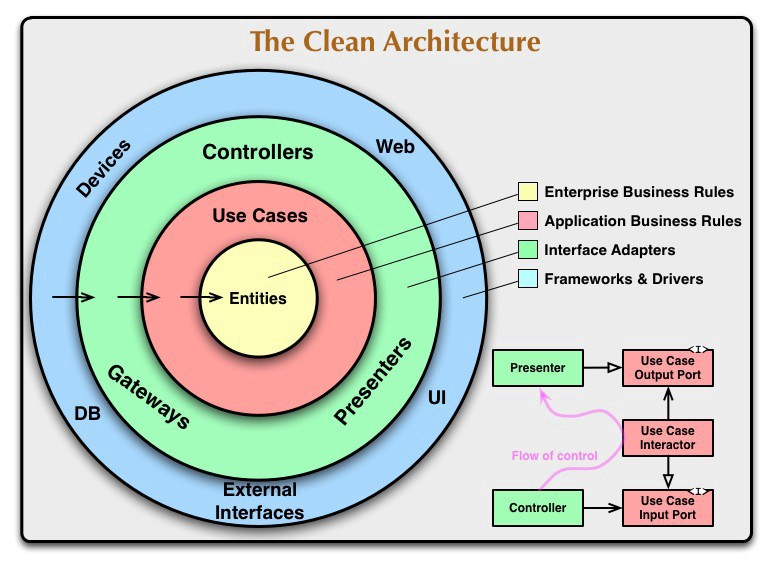
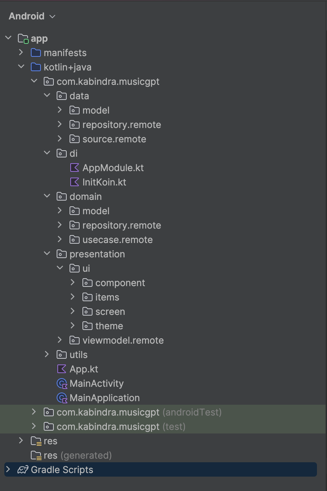

<p align="center"> 
    
</p>

<h1 align="center"> MusicGPT </h1>

MusicGPT is the leading AI-powered application in the audio domain, designed to help users interact,
create, and explore music intelligently. It is built with a modern, scalable, and maintainable
architecture to ensure high-quality performance and developer-friendly structure.

## Architecture

A well planned architecture is extremely important for an app to scale and all architectures have
one common goal- to manage complexity of your app. This isn't something to be worried about in
smaller apps however it may prove very useful when working on apps with longer development lifecycle
and a bigger team.

The project follows Clean Architecture combined with MVVM (Model-View-ViewModel) and Repository
Pattern to ensure separation of concerns, scalability, and testability.

<p align="center"></p>

## Flow:

### Screen → ViewModel → UseCase → Repository → RepositoryImpl → DataSources

## Layers

### Project Structure

<p align="center"></p>

### App

The ```app``` layer is responsible for common and general properties.

- __component__: This is responsible for general view.

- __View__: This is responsible for common view components that using app.

- __theme__: Defines themes, colors, fonts and resource files.

### Data

The ```data``` layer is responsible for selecting the proper data source for the domain layer. It
contains the implementations of the repositories declared in the domain layer.

Components of data layer include:

- __model__

  -__dto__: Defines dto of ui model, also perform data transformation between ```domain```,
  ```response``` and ```entity``` models.

  -__local__: Defines the schema of SQLite database.

  -__remote__: Defines POJO of network responses.

- __local__: This is responsible for performing caching operations using [Room].

- __remote__: This is responsible for performing network operations eg. defining API endpoints
  using [Retrofit or Ktor].

- __repository__: Responsible for exposing data to the domain layer.

### Domain

This is the core layer of the application. The ```domain``` layer is independent of any other layers
thus ] domain business logic can be independent from other layers.This means that changes in other
layers will have no effect on domain layer eg. screen UI (presentation layer) or changing database (
data layer) will not result in any code change withing domain layer.

Components of domain layer include:

- __usecase__: They enclose a single action, like getting data from a database or posting to a
  service. They use the repositories to resolve the action they are supposed to do. They usually
  override the operator ```invoke``` , so they can be called as a function.

### Presentation

The ```features``` layer contains components involved in showing information to the user. The main
part of this layer are the views(activity, compose) and ViewModels.

## Project Setup & Architecture

MusicGPT is built using modern Android/Kotlin best practices and is structured to be robust,
scalable, and easy to extend.

### Key Setup & Technologies

- __Clean Architecture with MVVM__:
  Separates the app into layers — Presentation, Domain, and Data — for maintainability and
  testability.

- __Koin for Dependency Injection__:
  Simplifies object creation and dependency management across the app.

- __Ktor HTTP Client__:
  Handles API calls efficiently with asynchronous, coroutine-based networking.

- __State & Event Management__:

    - __State__: Represents the UI data and automatically updates views on change.

    - __Events__: Capture user actions and system triggers, ensuring reactive and predictable flows.

### Project Flow

The architecture is structured as follows:

Screen → ViewModel → UseCase → Repository → RepositoryImpl → DataSource / API Service

- __Screen__: Composable UI layer that reacts to state updates.

- __ViewModel__: Handles UI state, events, and orchestrates interactions between UI and domain.

- __UseCase__: Encapsulates business logic for each feature.

- __Repository / RepositoryImpl__: Abstracts data sources and provides clean APIs to the domain
  layer.

- __DataSource / API Service__: Interfaces with remote or local data sources.

### Benefits

- __Reusable Models & Components__:
  Predefined components like buttons, text fields, lists, and cards are used consistently across
  screens.

- __Robust & Scalable__:
  Event and state-driven design allows for easy extension and addition of new features.

- __Good to Go for Further Tasks__:
  This setup provides a solid foundation for adding more features, integrating real APIs, or
  extending multi-platform support.

## Features & Functionality

### Default Splash Screen:

The app uses the system default splash screen for fast initial loading.

### Custom Splash Screen:

A custom splash screen is added to simulate an API hit and improve the user experience.

### Dashboard Navigation:

After the splash, users are redirected to the dashboard featuring:

- __Top Bar__: Displays the app logo.

- __Bottom Navigation__: Includes Home, Discover, Recommended, and Profile sections.

### Home Screen:

Simulates an API call by showing shimmer placeholders.

Loads mock music data smoothly.

### Mini Player Animations:

Clicking playable or generated music triggers a mini player with slide-in and fade-in animations.

Clicking unplayable items like queued or generating music triggers a slide-out and fade-out
animation.

### Create Music Input:

A Create button opens an attractive input text field.

The input field supports "queue" and "generate" keywords, featuring gradient borders and gradient
shadows for a modern ambience.

### Queue Music:

Entering the "queue" keyword adds a queued music item to the list.

Updates are reflected smoothly in the UI.

### Generate Music:

Entering the "generate" keyword creates a new music item.

Shows a generating state to simulate an API call.

The UI updates progress smoothly while generating music.

### Unlimited Music Actions:

Users can queue or generate multiple music items without limitations.

### Smooth Multi-Music Generation:

Multiple music generation processes run independently.

Each generating item updates smoothly and concurrently, providing a seamless experience.

### Demo Video Link: [](art/Screen_Recording.mov)